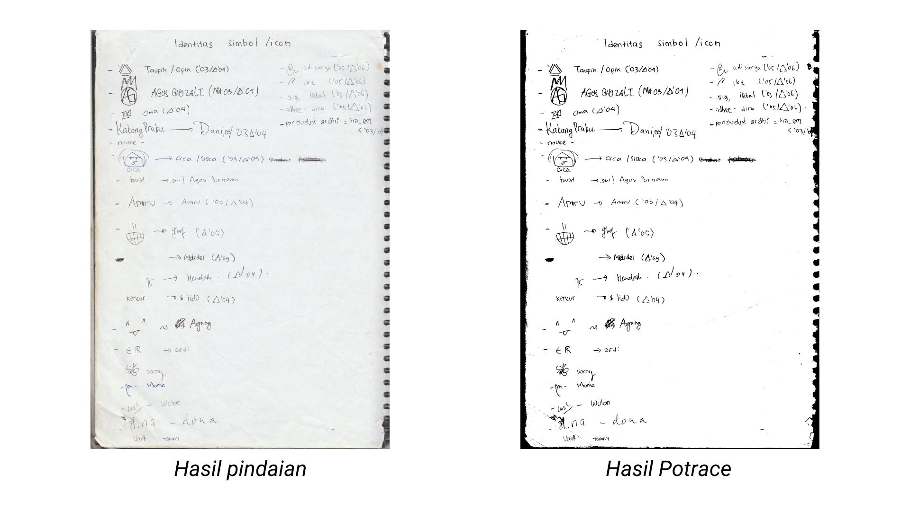

# Bukom HIMATIKA ITB 2006/2007

HIMATIKA ITB didirikan pada tanggal 23 November 1960, dan tetap aktif hingga hari ini. Ketika saya menjadi anggota Divisi Sarana dan Prasarana (masa kepengurusan HIMATIKA 2018/2019), ada beberapa kumpulan buku kenangan lawas yang saya temukan. Seperti kebanyakan buku lawas lainnya, mereka rentan mengalami kerusakan: penguningan warna akibat reaksi asam pada kertas, kelembapan dan air yang melunturkan tinta dan/atau mengerutkan kertas, 'serangan' biologis seperti jamur dan rayap, dan lain sebagainya. Untuk menjaga kenangan dari alumni-alumni sebelum kami, saya mendigitalkan buku-buku tersebut dengan memindainya.


Salah satu buku yang saya digitalkan berjudul "Bukom HIMATIKA ITB". Buku ini dapat diibaratkan grup chat WhatsApp, dalam bentuk buku. Terdapat 182 halaman, yang saya pindai dengan spesifikasi DPI 300 (jika saya tidak salah ingat). Setiap halaman berisi teks dan/atau gambar yang ditulis dengan menggunakan pensil, pulpen, dan/atau spidol. Walaupun sudah terdigitalkan dalam bentuk berkas JPG, format ini tidak fleksibel untuk diakses oleh para anggota himpunan maupun alumni. Saya berpikir bahwa menggabungkan semua foto dan menyajikannya dalam sebagai sebuah berkas PDF akan jauh lebih baik. Tentunya ukuran berkas PDF tidak boleh besar, dan isi PDF mengawetkan tampilan aslinya (bentuk tulisan, coretan, maupun gambar).

## Hasil
Berikut adalah hasil yang didapatkan dari pendekatan saya:


## Pendekatan yang saya gunakan
Untuk membuat ukuran berkas PDF yang kecil, saya berpikir untuk menyimpan gambar dalam bentuk SVG. Format SVG memungkinkan saya menghilangkan banyak informasi yang "tidak penting", seperti warna kertas, warna goresan tinta pada setiap pikselnya, dan sebagainya. Saya tidak memiliki banyak waktu kosong, khususnya untuk menggunakan program komputer dan membersihkan setiap halaman satu-per-satu. Oleh karena itu, saya menggunakan program *command-line* `imagemagick` dan `potrace` yang dapat menyunting banyak gambar dengan cepat dan mudah. Sebagai gantinya, saya terpaksi mengeloskan beberapa gambar tidak tersunting dengan baik (beberapa tulisan tidak terbaca jelas, ada artefak hasil pemindaian yang tertinggal, dsb.).
## Kode
Berikut kode yang saya gunakan
```bash
mkdir tmp out;

for file in raw/*.jpg; do
  fname="$(basename "$file" .jpg)";
  echo "$fname";

  # Ubah JPG ke bentuk Black-White
  # level 83% dipilih dari mencari pengaturan terbaik dari beberapa halaman uji
  # file PNM digunakan karena Potrace hanya dapat memroses tipe file tersebut
  convert "$file" -threshold 83% "tmp/$fname.pnm";

  # Mengubah JPG langsung ke PNM tidak disarankan karena tidak akan ada kontrol
  # pada hasil Potrace (tulisan dengan menggunakan pensil tidak terbaca, ada
  # hasil tinta yang lebih tebal daripada seharusnya, dst.) karena Potrace
  # hanya dapat menghasilkan SVG Black-White.
done

# Ada baiknya mengecek folder tmp untuk melihat hasil sementara yang dihasilkan.
# Anda dapat memperbaiki tampilan halaman-halaman yang bermasalah disini

for file in tmp/*.pnm; do
  fname="$(basename "$file" .pnm)";
  echo "$fname";

  # Mengubah PNM menjadi SVG.
  potrace "$file" -s -o "out/$fname.svg";
done

# Kumpulkan setiap SVG ke dalam satu PDF
rsvg-convert -f pdf -o bukom.pdf out/*.svg
```

## Ikut Serta
Jika Anda berniat untuk mengunduh berkas PDF yang dihasilkan, mengunduh berkas gambar-gambar hasil pindaian (misalnya karena ingin memroses sendiri gambar), atau berkontribusi dengan menambahkan pendekatan yang Anda gunakan, silahkan kontak saya.  
